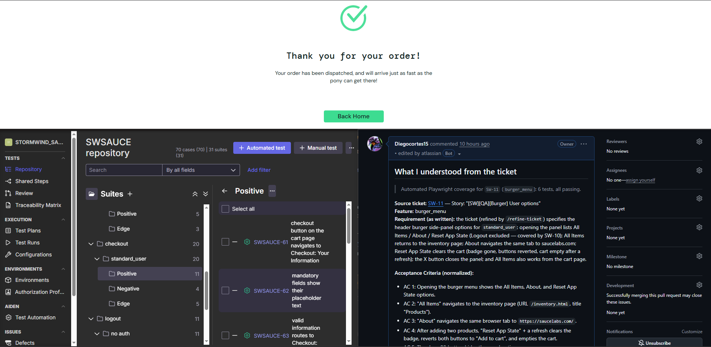
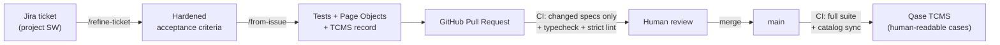
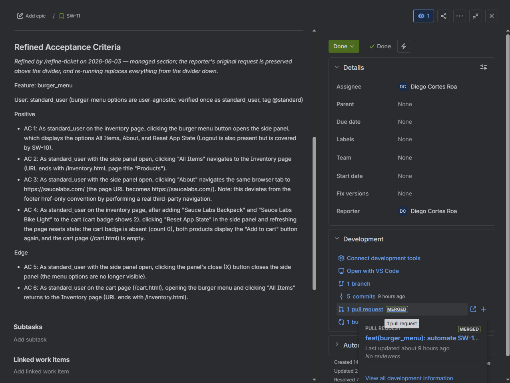
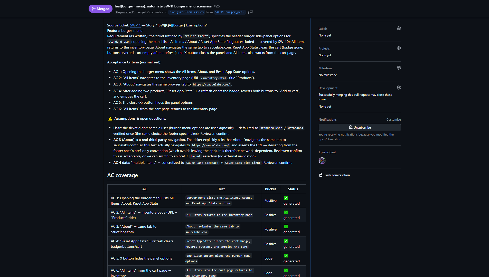
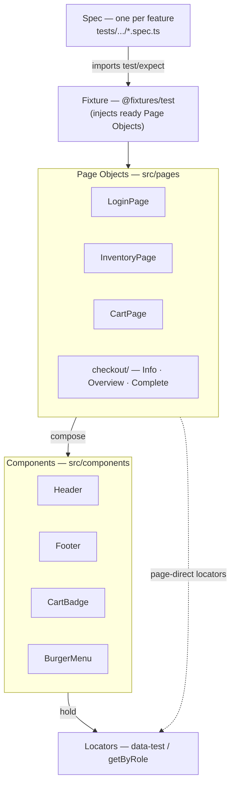
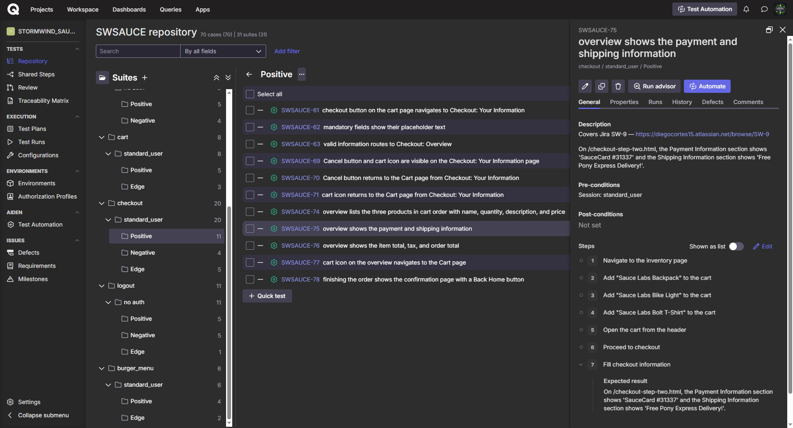

# Playwright IA Automation Framework — Saucedemo

[](https://github.com/Diegocortes15/playwright-ia-automation-framework-saucedemo/actions/workflows/test.yml)


> An end-to-end test framework where **a Jira ticket becomes a reviewed, TCMS-mirrored Playwright pull request** — authored by AI agents, gated by deterministic CI. Built on [saucedemo](https://www.saucedemo.com) as both a **reusable template** and a **portfolio piece**.



The framework is **code-first and AI-extended**. Tests are plain, fast, deterministic Playwright + TypeScript — nothing exotic at runtime. The "AI" part is the _authoring_ layer: a set of custom [Claude Code](https://claude.ai/code) skills read a Jira ticket, generate Page-Object-backed tests, run them, and open a GitHub PR — optionally mirroring each test into a [Qase](https://qase.io) TCMS so non-technical reviewers can browse human-readable cases. A human reviews and merges; CI keeps everything honest.

---

## How it works — the pipeline

The whole system, top-down: a ticket goes in one end, a reviewed-and-mirrored test comes out the other.



1. **`/refine-ticket`** hardens a Jira ticket's acceptance criteria against a "bulletproof" rubric (grounded in the existing automation + app docs) and writes the refined ACs back to Jira — so the next step has nothing to guess.
2. **`/from-issue`** reads the refined ticket through the **Atlassian MCP**, generates tests + Page Objects (scaffolding new ones via `/scaffold-page-object`, verifying selectors live via `playwright-cli`), runs them, writes a committed TCMS record, and opens a **GitHub PR**.
3. **CI on the PR** runs **only the spec files that PR changed** + a **typecheck + strict-lint gate** — fast, focused feedback.
4. **A human reviews and merges** — the PR is the review gate.
5. **CI on merge** runs the **full suite**, **syncs the catalog to Qase**, and commits the refreshed id map back — so the mirror stays accurate with zero manual steps.

---

## Highlights

- 🎫 **Ticket-to-PR automation** — `/from-issue SW-123` turns a Jira story into a passing, reviewed Playwright PR.
- 🧩 **Composed Page Objects** — strict Page Object + Component model (`Header`, `Footer`, `CartBadge`, `BurgerMenu`) with enforced composition rules.
- 🔐 **Data-driven auth matrix** — Playwright projects derive from a single `AUTH_USERS` array; the toolchain grows the matrix one user at a time, only as tickets need it.
- 🗂️ **Opt-in TCMS mirror** — one-way code→[Qase](https://qase.io) sync at merge: human-readable cases with steps, per-case Jira provenance, and an auto-maintained id map.
- ⚡ **Smart CI** — PRs run only their changed specs; merges run the full suite; a typecheck + `--max-warnings 0` lint gate blocks regressions before they land.
- 📣 **Scheduled & notified** — an every-other-day smoke and a biweekly regression run themselves, each recording a Qase run and posting the result (with duration + environment) to Slack.
- 🌐 **Config-driven** — base URL, credentials, and TCMS settings come from env; point it at a different app without touching code.
- 📚 **Documented decisions** — every architectural choice is an ADR; the AI rules live in [`CLAUDE.md`](CLAUDE.md).

---

## Tech stack

| Area           | Choice                                                          |
| -------------- | --------------------------------------------------------------- |
| Runtime / lang | Node 22 · TypeScript 5.9 (strict)                               |
| Test runner    | Playwright 1.59 (`@playwright/test`)                            |
| Quality gates  | ESLint v9 flat config + `eslint-plugin-playwright` · Prettier 3 |
| CI/CD          | GitHub Actions (change gate + scheduled runs) · Slack alerts    |
| TCMS           | Qase (REST, behind a swappable seam)                            |
| Ticket source  | Jira (via the Atlassian MCP)                                    |
| AI authoring   | Claude Code custom skills + `@playwright/cli`                   |

---

## The AI-assisted workflow (skills)

The authoring layer is four composable [Claude Code skills](.claude/skills/). They build on each other top-down:

| Skill                       | What it does                                                                                                                     | Writes to        |
| --------------------------- | -------------------------------------------------------------------------------------------------------------------------------- | ---------------- |
| **`/refine-ticket`**        | Hardens a Jira ticket's ACs against a rubric; writes the refined criteria back. ([guide](docs/refine-ticket.md))                 | Jira             |
| **`/from-issue`**           | Reads a ticket → generates tests + Page Objects → runs them → opens a GitHub PR (+ a TCMS record). ([guide](docs/from-issue.md)) | Repo + GitHub PR |
| **`/scaffold-page-object`** | Generates a draft Page Object from a live page snapshot, composing detected components. ([guide](docs/scaffold-page-object.md))  | Repo             |
| **`playwright-cli`**        | Drives a real browser to discover/verify selectors and read the rendered DOM before authoring. ([guide](docs/playwright-cli.md)) | — (read-only)    |



`/from-issue` is the conductor: it calls `/scaffold-page-object` when a Page Object doesn't exist yet, uses `playwright-cli` to confirm selectors, grows the auth harness when a ticket needs an unwired user, and surfaces every assumption it made in the PR body for the reviewer.

> **📋 See a real example →** [**PR #25 — _automate SW-11 burger menu scenarios_**](https://github.com/Diegocortes15/playwright-ia-automation-framework-saucedemo/pull/25) is an actual `/from-issue` pull request from this repo. Its description carries the auto-generated **"What I understood"** summary, the **AC-coverage table**, the **⚠️ Assumptions** the agent flagged for review, and the verification results — exactly what a reviewer reads before merging.



---

## Integrations — how the agent reaches the outside world

The AI-authoring layer talks to four external systems. Each connection choice is a documented ADR — notably, tickets come from **Jira via the Atlassian MCP** (not `gh issue`), while all **GitHub** actions run through the **`gh` CLI** (not a GitHub MCP server).

| System                    | Connected via                  | Direction       | Notes                                                                                                                                                 |
| ------------------------- | ------------------------------ | --------------- | ----------------------------------------------------------------------------------------------------------------------------------------------------- |
| **Jira** — tickets        | **Atlassian MCP**              | read + write¹   | The single source of tickets: `/from-issue SW-123` reads the ticket (project `SW`) through the MCP, never `gh issue`. ([ADR-0011](docs/adr/))         |
| **GitHub** — PRs/runs/API | **`gh` CLI** (authenticated)   | read + write    | Every GitHub op — open the PR, read workflow runs, arbitrary REST — runs through `gh`. We deliberately run **no** GitHub MCP. ([ADR-0007](docs/adr/)) |
| **Qase** — TCMS           | REST (behind a swappable seam) | write (one-way) | Code→Qase mirror at merge + labeled `qase:*` runs. ([docs/tcms.md](docs/tcms.md))                                                                     |
| **Slack** — notifications | Incoming webhook               | write           | Scheduled/on-demand run outcomes (see [Continuous integration](#continuous-integration)).                                                             |

¹ Only **`/refine-ticket`** writes back to Jira (the hardened acceptance criteria — [ADR-0013](docs/adr/)); every other skill reads Jira only. The `@playwright/cli` skill also drives a real browser locally to discover/verify selectors, but that's a dev tool, not an external service.

---

## Architecture

Strict, one-directional composition: **tests know Pages; Pages compose Components; Components hold Locators.** Tests never touch a raw Locator.



**Key ideas:**

- **Composition rules are enforced** — e.g. Pages never return other Pages, queries return data (never `Locator`), component nesting depth ≤ 2. The full list is in [`CLAUDE.md`](CLAUDE.md) and [`docs/architecture.md`](docs/architecture.md).
- **Fixtures inject ready Page Objects** — specs `import { test, expect } from '@fixtures/test'` and receive `loginPage`, `inventoryPage`, … pre-wired.
- **Data-driven projects** — `playwright.config.ts` derives its projects from `tests/users.ts` `AUTH_USERS` (`['standard', 'problem']` today). Each user yields a `setup-<user>` (storageState) + `chromium-<user>` project, plus `chromium-no-auth`. New users wire in on demand; cross-browser is a deliberate separate decision ([ADR-0004](docs/adr/)).
- **Role tags route tests to projects** — `@no-auth`, `@standard`, `@problem`, `@all-users`, `@smoke` (see the tag table in [`CLAUDE.md`](CLAUDE.md)).

**Coverage so far:** login · inventory (content + sort) · footer · cart · checkout (information → overview → complete) · logout · burger menu.

---

## TCMS mirror (Qase)

An **opt-in, one-way** mirror so non-technical reviewers can browse human-readable cases. Off unless `QASE_*` is configured.

- **At merge**, CI runs `tcms:sync` — it creates/updates/archives Qase **cases** (suite tree `feature › context › bucket`, steps from `test.step`, expected result = the ticket's AC text, per-case Jira provenance) and commits the refreshed `qase-map.json` (the test→case id index) back to the branch. **No run is created** — merges stay noise-free.
- **Runs are explicit** — `npm run qase:smoke` / `qase:regression` execute a scope _and_ record a labeled Qase run; `tcms:run` records an ad-hoc run from the last results.
- **Swappable** — `src/tcms/qase-client.ts` is the only Qase-aware file; it implements a tool-agnostic seam, so Xray/Zephyr/etc. is a sibling client. Full design in [`docs/tcms.md`](docs/tcms.md).



---

## Continuous integration

Two workflows: **[`test.yml`](.github/workflows/test.yml)** gates every change; **[`regression.yml`](.github/workflows/regression.yml)** runs scheduled and on-demand suites.

### `test.yml` — the change gate

| Event              | What runs                                                                                     | Why                                              |
| ------------------ | --------------------------------------------------------------------------------------------- | ------------------------------------------------ |
| **Pull request**   | typecheck + lint (`--max-warnings 0`) → **only the spec files the PR changed**                | Fast, focused feedback; scales to large suites   |
| **Push to `main`** | typecheck + lint → **full suite** → Qase catalog sync → auto-commit refreshed `qase-map.json` | A complete gate + an always-accurate TCMS mirror |

The "changed specs only" selection is a deliberate choice over Playwright's `--only-changed` (which follows the import graph and re-runs the world when a shared fixture changes) — the full suite on merge is the real integration gate.

### `regression.yml` — scheduled + on-demand

Runs the full suite or a `@smoke` scope, records a **labeled Qase run**, uploads the HTML report, and **posts the result to Slack**.

| Trigger                    | Cadence                                               | Suite           |
| -------------------------- | ----------------------------------------------------- | --------------- |
| **Scheduled — smoke**      | every other day · 00:00 Bogotá (midnight)             | `@smoke`        |
| **Scheduled — regression** | biweekly · Sun 23:00 Bogotá (the night before Monday) | full suite      |
| **On demand**              | Actions → **Run workflow** → pick the suite           | smoke _or_ full |

Each run posts a **Slack** message carrying the outcome (**pass/fail + counts**), the **run duration**, the **environment** it executed on, a **Qase run** link, the **GitHub run** link (→ report artifact), and an **automated-vs-manual + who-triggered** identifier. One workflow serves both cadences plus manual runs, distinguished by `github.event.schedule`; scheduling times are Bogotá (UTC−5) and the biweekly regression runs the night before so it's ready to read Monday morning.

---

## Reports & debugging

Every run produces a self-contained **HTML report** (`playwright-report/`) and, because `trace: 'on'`, a **trace** for _every_ test — so the [Trace Viewer](https://playwright.dev/docs/trace-viewer) (a full timeline: actions, DOM snapshots, network, console) is available for any test, not just failures. Screenshots and video are additionally captured **on failure**.

### Locally

```bash
npm test                 # runs + writes playwright-report/ and per-test traces
npm run report           # open the HTML report in a browser
```

In the report, click a test → **Traces** to open the trace viewer inline. Or open a trace file directly:

```bash
npx playwright show-trace test-results/<test-dir>/trace.zip
```

### From CI (GitHub Actions)

The report is uploaded as an artifact on **every** run (pass or fail), so you can inspect any run:

1. Open the workflow run → **Summary** → **Artifacts** → download **`playwright-report`**.
2. Unzip it, then serve it locally (the traces are bundled inside, so the viewer works too):

```bash
npx playwright show-report ./playwright-report
```

### What's captured when

| Artifact    | When       | Config (`playwright.config.ts`) |
| ----------- | ---------- | ------------------------------- |
| Trace       | every test | `trace: 'on'`                   |
| Screenshot  | on failure | `screenshot: 'only-on-failure'` |
| Video       | on failure | `video: 'retain-on-failure'`    |
| HTML report | every run  | `reporter: [['html', …]]`       |

Each report's header also records **how long the run took** and the **environment it executed on** — OS · Chromium · Node · Playwright — via `metadata` in `playwright.config.ts`. It's the same environment line the Slack notification and the Qase run description carry, sourced once (no browser launch) from [`src/utils/run-environment.ts`](src/utils/run-environment.ts).

> `trace: 'on'` makes the trace viewer available everywhere at the cost of larger artifacts + slightly slower runs — a deliberate trade for always-on debuggability. Switch to `retain-on-failure` if that ever becomes heavy.
>
> _Optional next step:_ the CI report is a downloadable artifact, not a hosted link. To get a clickable per-run report URL, publish `playwright-report/` to GitHub Pages.

---

## Getting started

### Prerequisites

- Node.js **22.x** or newer · `git` · ~300 MB free disk for the Chromium browser

### Install & run

```bash
git clone https://github.com/Diegocortes15/playwright-ia-automation-framework-saucedemo.git
cd playwright-ia-automation-framework-saucedemo
npm install
npx playwright install chromium
cp .env.example .env          # baseURL + password (saucedemo defaults work out of the box)
npm test                      # full suite, green in ~under a minute
```

> The AI-authoring workflow (the `/from-issue` etc. skills) additionally requires Claude Code, the Atlassian MCP connected, and `gh` authenticated. The tests themselves need none of that.

---

## npm scripts

| Script                                           | What it does                                               |
| ------------------------------------------------ | ---------------------------------------------------------- |
| `npm test`                                       | Full matrix across all data-driven projects                |
| `npm run test:standard`                          | Only `chromium-standard` (fast local iteration)            |
| `npm run test:smoke` / `test:regression`         | `@smoke`-tagged tests / the full suite (run-only, no TCMS) |
| `npm run test:debug` / `test:headed` / `test:ui` | Standard project under Inspector / headed / UI mode        |
| `npm run test:unit`                              | Browserless unit tests for the TCMS modules                |
| `npm run report` / `codegen`                     | Open the last HTML report / Playwright codegen             |
| `npm run typecheck`                              | `tsc --noEmit` (strict)                                    |
| `npm run lint` / `lint:fix`                      | ESLint (`--max-warnings 0`) / with autofix                 |
| `npm run format` / `format:check`                | Prettier write / check                                     |
| `npm run qase:smoke` / `qase:regression`         | Run a scope **and** record a labeled Qase run              |
| `npm run tcms:sync` / `tcms:run`                 | Sync the Qase catalog / record an ad-hoc Qase run          |

---

## Project structure

```
.
├── src/
│   ├── pages/          # Page Objects (LoginPage, InventoryPage, CartPage, checkout/*)
│   ├── components/     # Reusable components (Header, Footer, CartBadge, BurgerMenu)
│   ├── fixtures/       # Playwright fixture — injects Page Objects into tests
│   ├── tcms/           # Qase TCMS mirror (seam, case-mapper, sync, client)
│   └── utils/          # env config (single process.env read point) + logger
├── data/               # Reference data (shared/products.json) + typed loaders (@data/*)
├── tests/              # Specs (one folder per feature) + auth.setup.ts + users.ts
├── auth/               # Generated storageState (git-ignored)
├── .claude/skills/     # AI authoring skills (from-issue, refine-ticket, scaffold-page-object, playwright-cli)
├── docs/               # architecture, app/, adr/, skill guides, tcms, superpowers/
└── .github/workflows/  # GitHub Actions CI
```

---

## Configuration

All environment config flows through `src/utils/env.ts` (the single `process.env` read point). Copy `.env.example` → `.env`:

| Variable             | Required | Purpose                                                  |
| -------------------- | -------- | -------------------------------------------------------- |
| `SAUCEDEMO_BASE_URL` | no       | App under test (defaults to `https://www.saucedemo.com`) |
| `SAUCEDEMO_PASSWORD` | yes      | Login password (saucedemo's `secret_sauce`)              |
| `QASE_API_TOKEN`     | no       | Enables the Qase TCMS mirror (unset = mirror off)        |
| `QASE_PROJECT_CODE`  | no       | Qase project code                                        |
| `QASE_API_HOST`      | no       | Override only for self-hosted Qase                       |

In CI these are GitHub Actions secrets.

---

## Documentation

| File                                             | Purpose                                             |
| ------------------------------------------------ | --------------------------------------------------- |
| [`CLAUDE.md`](CLAUDE.md)                         | AI rules — auto-loaded by Claude Code               |
| [`docs/architecture.md`](docs/architecture.md)   | Framework structure, composition rules, conventions |
| [`docs/from-issue.md`](docs/from-issue.md)       | The ticket-to-PR skill, in depth                    |
| [`docs/refine-ticket.md`](docs/refine-ticket.md) | The ticket-hardening skill                          |
| [`docs/tcms.md`](docs/tcms.md)                   | The Qase TCMS mirror design                         |
| [`docs/app/`](docs/app/)                         | About the app under test (saucedemo users + flows)  |
| [`docs/adr/`](docs/adr/)                         | Architecture Decision Records (numbered)            |
| [`docs/runbook.md`](docs/runbook.md)             | Operational runbook                                 |
