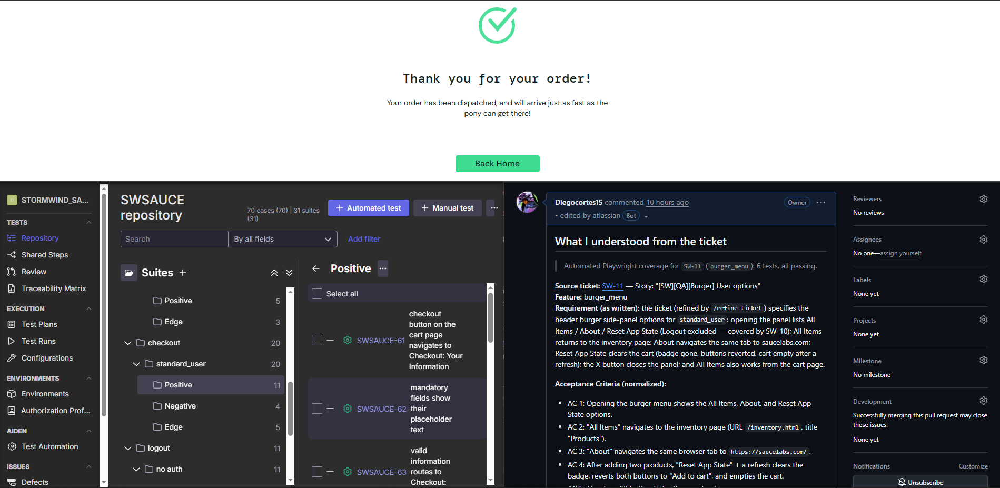
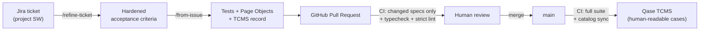
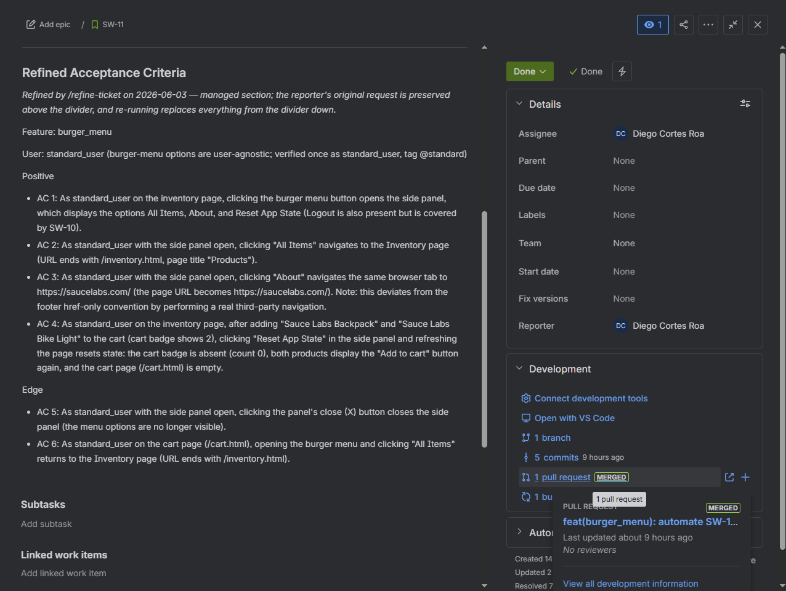
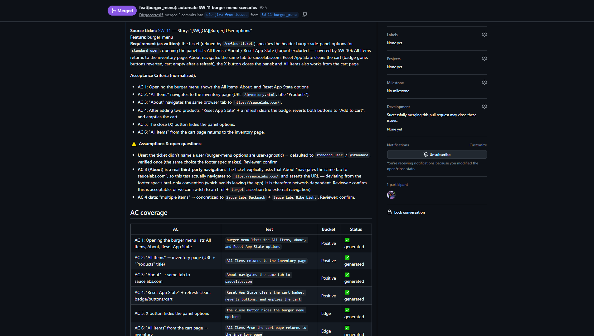
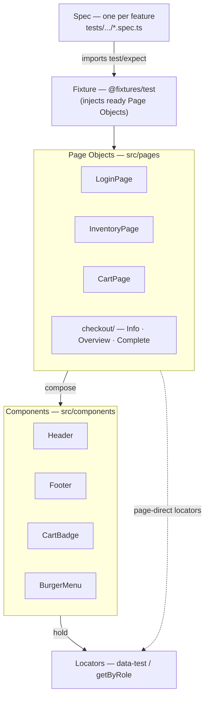
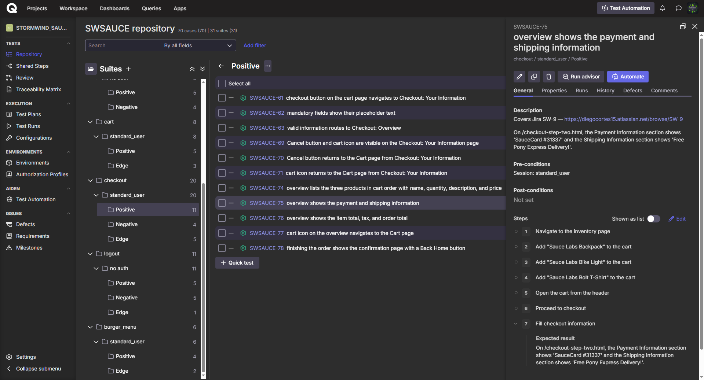

# Playwright IA Automation Framework — Saucedemo

[](https://github.com/Diegocortes15/playwright-ai-framework/actions/workflows/test.yml)


> An end-to-end test framework where **a Jira ticket becomes a reviewed, TCMS-mirrored Playwright pull request** — authored by AI agents, gated by deterministic CI. Built on [saucedemo](https://www.saucedemo.com) as both a **reusable template** and a **portfolio piece**.

**In four bullets:**

- **A ticket goes in; a reviewed pull request comes out** — the tests, the Page Objects they need, and the acceptance criterion each test covers.
- **The AI writes once. Every run after that is plain Playwright** reading committed files. Clone this and run `npm test` with no Claude Code installed and you still get the Jira links and the criteria.
- **A run never opens a red PR.** It diagnoses and retries up to three times; if the _application_ is what contradicts the ticket, it opens nothing and says so.
- **11 of 14 generated PRs landed exactly as generated** — measured, with its caveats, [below](#the-skills).



---

## Quick start

```bash
git clone https://github.com/Diegocortes15/playwright-ai-framework.git
cd playwright-ai-framework
npm install
npx playwright install chromium
cp .env.example .env          # saucedemo defaults work out of the box
npm test
```

**83 tests, ~24 seconds.** The tests need nothing else — no Claude Code, no Jira, no Qase account. The AI-authoring layer is additive and entirely optional.

Node **22.x** is enforced rather than suggested: `.nvmrc`, an `engines` field and `engine-strict=true` mean `npm install` refuses another major instead of warning.

**Another engine, when you want one.** Cross-browser is implemented and **opt-in** ([ADR-0027](docs/adr/0027-cross-browser-opt-in.md)) — `npm test` never pays for it:

```bash
npx playwright install firefox webkit    # ~175 MB, once
npm run test:firefox                     # the standard user on Gecko
npm run test:cross -- --grep "@smoke"    # both engines, smoke only — 9 tests, ~11s
```

The full standard suite passes on both: **79 tests on Firefox (~45s), 79 on WebKit (~31s)**, against 83 on chromium in ~25s. Only the standard user goes cross-browser — engine differences live in the framework's interaction code, not in saucedemo's per-user bugs.

Its first real use paid for itself: WebKit exposed a race in `InventoryPage.goto()` that chromium had always won, and the fix landed with it ([ADR-0027](docs/adr/0027-cross-browser-opt-in.md)).

---

## See it work — a five-minute demo

Everything here runs locally against the public app. Good for showing someone what the framework does without reading any code.

### 1. A run where failing is the correct outcome

```bash
npx playwright test --project=chromium-problem
```

```
✘ problem_user sorts products by name descending
✘ problem_user sorts products by price ascending
✓ problem_user sees one identical broken image for every product

4 passed (3.7s)
```

**Two tests failed and the suite is green.** They are locked to a real, open defect with `test.fail()`, so they assert the _correct_ behaviour while the bug is open. The day it is fixed, the run reports **"Expected to fail, but passed."** and someone has to come remove the marker — the suite notifies you instead of relying on memory ([ADR-0024](docs/adr/0024-blocked-test-lands-as-expected-failure.md)).

### 2. Why it failed, in a sentence a non-engineer can read

```bash
npm run report
```

Click either failing test → **Annotations**. Every generated test carries its Jira links, the acceptance criterion it covers, and — when it is locked to a defect — a plain-language explanation:

> **known defect** · SW-14 — the inventory sort dropdown discards the selection for problem_user: the `<select>`'s own value reverts to `az`, so neither the active label nor the product order ever changes. This test asserts the correct behaviour and is expected to fail while the defect is open, so the suite stays green. The day it is fixed the run reports "Expected to fail, but passed." — remove the `test.fail()` marker in that same pull request.

### 3. What the app did that no test asserted on

```bash
npm run observations
```

Every run records console errors, uncaught exceptions, failed requests and native dialogs, then renders them as prose — **network and console without opening devtools**:

```
**0 not yet reviewed · 14 reviewed.**

#### ⚠️ failed request (third party) (reviewed)
The page asked a third-party service for `POST https://events.backtrace.io/…` and got
back **401** — the request was rejected as unauthorised.
```

Observations **never fail a test** — the fixture records, it never judges ([ADR-0021](docs/adr/0021-runtime-observations.md)). Triage is human and durable: mark an entry `ignored` with a note and it stays quiet across runs.

### 4. The full picture — DOM, network, console, step by step

`trace: 'on'` means **every** test has a trace, not just failures. In the HTML report, click a test → **Traces** for an inline timeline with DOM snapshots at every action.

### 5. Turn a failure into a bug report draft

With Claude Code: **`/report-bug`**. It assembles repro steps, the acceptance criterion the test traces to, expected vs. actual, correlated observations, and copies the screenshot, video and trace into one attachable folder. **It files nothing** — you read the draft and decide.

---

## How it works — the pipeline


```mermaid
flowchart LR
    J["Jira ticket<br/>(project SW)"] -->|"/refine-ticket"| R["Hardened<br/>acceptance criteria"]
    R -->|"/from-issue"| G["Tests + Page Objects<br/>+ TCMS record"]
    G --> PR["GitHub Pull Request"]
    PR -->|"CI: changed specs only<br/>+ typecheck + strict lint"| Rev["Human review"]
    Rev -->|merge| M["main"]
    M -->|"CI: full suite<br/>+ catalog sync"| Q["Qase TCMS<br/>(human-readable cases)"]
```

1. **`/refine-ticket`** hardens a ticket's acceptance criteria against a rubric and writes them back to Jira — so the next step has nothing to guess.
2. **`/from-issue`** reads the ticket through the **Atlassian MCP**, generates tests + Page Objects, runs them, writes a committed TCMS record, and opens a **PR**. It **never opens a red PR**: on failure it diagnoses and retries up to three times, and if the _app_ is what contradicts the criterion, it reports and opens nothing ([ADR-0020](docs/adr/0020-no-red-pr.md)).
3. **CI on the PR** runs only the specs that PR changed, behind a typecheck + strict-lint gate.
4. **A human reviews and merges** — the PR is the review gate.
5. **CI on merge** runs the full suite, syncs the catalog to Qase, and commits the refreshed id map back.

---

## The skills

Five [Claude Code skills](.claude/skills/) — four written here, one vendored from `@playwright/cli`.

| Skill                       | What it does                                                                    | Writes to      |
| --------------------------- | ------------------------------------------------------------------------------- | -------------- |
| **`/refine-ticket`**        | Hardens a ticket's ACs, writes them back. ([guide](docs/refine-ticket.md))      | Jira           |
| **`/from-issue`**           | Ticket → tests → PR, never red. ([guide](docs/from-issue.md))                   | Repo + PR      |
| **`/scaffold-page-object`** | Draft Page Object from a live snapshot. ([guide](docs/scaffold-page-object.md)) | Repo           |
| **`/report-bug`**           | A failed run → a bug-report draft with evidence. **Files nothing.**             | — (draft only) |
| **`playwright-cli`**        | Drives a real browser to verify selectors. ([guide](docs/playwright-cli.md))    | — (read-only)  |

`/from-issue` is the conductor: it calls `/scaffold-page-object` when a Page Object is missing, uses `playwright-cli` to confirm selectors against the live DOM, and grows the auth matrix when a ticket needs an unwired user.

### Why skills, and why exactly one MCP server

The interesting part is not that this uses skills — it is that it **uses one MCP server and deliberately refuses another**, on a rule rather than a preference:

- **A CLI, when a good one already exists.** GitHub goes through `gh` ([ADR-0007](docs/adr/)) and the browser through `playwright-cli` ([ADR-0006](docs/adr/)) — both already installed and authenticated, more token-efficient than a server, and neither needs a PAT in the repo or an MCP registration.
- **An MCP server, when there is no such CLI and OAuth beats a secret.** Jira reads go through the Atlassian MCP ([ADR-0011](docs/adr/)) for two named reasons: no Jira CLI is as ubiquitous as `gh`, and its OAuth means **no API token lives in this repository**.
- **A skill for the workflow itself.** Skills are the _procedure_ — read the ticket, scaffold, generate, run, open the PR. The CLI and the MCP are just how it reaches out.

ADR-0011 says outright that it **scopes** ADR-0007 rather than reversing it, which is the honest shape: `gh` still owns GitHub, the MCP owns Jira only. Only `/refine-ticket` ever writes to Jira ([ADR-0013](docs/adr/)); Qase is written one-way at merge, and Slack receives scheduled-run outcomes.

**What it costs:** an MCP server is a connection that can drop, and it did — Jira access was lost to inactivity and needed a fresh session to reconnect. A CLI does not have that failure mode. The trade bought no secrets in the repo, and that was judged worth it.

**How well it works, measured:** of **14** merged `/from-issue` pull requests, **11 landed exactly as generated**. The other three needed one follow-up commit each — extracting a component, removing a conditional from a test body, and tightening a locator to an exact match. Two caveats that keep the number honest: there is a **single reviewer**, and a change amended into the original commit would be invisible to this count.



> **📋 A real example →** [**PR #25 — _automate SW-11 burger menu scenarios_**](https://github.com/Diegocortes15/playwright-ai-framework/pull/25) is an actual `/from-issue` pull request. Its description carries the auto-generated **"What I understood"** summary, the **AC-coverage table**, and the **⚠️ Assumptions** the agent flagged for review.



---

## Architecture

Strict one-directional composition: **tests know Pages; Pages compose Components; Components hold Locators.** Tests never touch a raw Locator.


```mermaid
flowchart TD
    Spec["Spec — one per feature<br/>tests/.../*.spec.ts"] -->|"imports test/expect"| Fix["Fixture — @fixtures/test<br/>(injects ready Page Objects)"]
    Fix --> Pages
    subgraph Pages["Page Objects — src/pages"]
        LP[LoginPage]
        IP[InventoryPage]
        CP[CartPage]
        CK["checkout/ — Info · Overview · Complete"]
    end
    Pages -->|compose| Comps
    subgraph Comps["Components — src/components"]
        H[Header]
        F[Footer]
        CB[CartBadge]
        BM[BurgerMenu]
    end
    Comps -->|hold| Loc["Locators — data-test / getByRole"]
    Pages -.->|"page-direct locators"| Loc
```

- **The rules are enforced, not suggested** — Pages never return Pages, queries return data (never a `Locator`), nesting depth ≤ 2, no XPath, no `waitForTimeout`. ESLint fails the build on the checkable ones. Full list in [`CLAUDE.md`](CLAUDE.md) and [`docs/architecture.md`](docs/architecture.md).
- **Data-driven projects** — `playwright.config.ts` derives every project from `tests/users.ts` `AUTH_USERS` (`['standard', 'problem']` today). Each user yields `setup-<user>` + `chromium-<user>`, plus `chromium-no-auth`. New users wire in on demand ([ADR-0014](docs/adr/)); cross-browser is a separate deliberate decision ([ADR-0004](docs/adr/)).
- **Tags route tests to projects** — `@no-auth`, `@standard`, `@problem`, `@all-users`, `@smoke`. They live in the `{ tag }` option, never in the title ([ADR-0015](docs/adr/)) — a lint rule enforces it.

**Coverage:** login · inventory (content + sort) · product detail · footer · cart · checkout (information → overview → complete) · logout · burger menu.

---

## Continuous integration

| Workflow                                             | Trigger                                     | What runs                                                                   |
| ---------------------------------------------------- | ------------------------------------------- | --------------------------------------------------------------------------- |
| [`test.yml`](.github/workflows/test.yml)             | Pull request                                | typecheck + lint (`--max-warnings 0`) → **only the specs the PR changed**   |
| [`test.yml`](.github/workflows/test.yml)             | Push to `main`                              | typecheck + lint → **full suite** → Qase sync → commit refreshed `qase-map` |
| [`regression.yml`](.github/workflows/regression.yml) | smoke every other day · regression biweekly | the scope + a labeled Qase run + an HTML report + a Slack message           |
| [`regression.yml`](.github/workflows/regression.yml) | Actions → **Run workflow**                  | smoke _or_ full, on demand                                                  |

"Changed specs only" is a deliberate choice over Playwright's `--only-changed`, which follows the import graph and re-runs the world when a shared fixture changes; the full suite on merge is the real integration gate. Each scheduled run posts pass/fail counts, duration, environment, and links to the Qase run and the report artifact.

**What's captured when:**

| Artifact    | When       | Config                          |
| ----------- | ---------- | ------------------------------- |
| Trace       | every test | `trace: 'on'`                   |
| Screenshot  | on failure | `screenshot: 'only-on-failure'` |
| Video       | on failure | `video: 'retain-on-failure'`    |
| HTML report | every run  | `reporter: [['html', …]]`       |

`trace: 'on'` buys always-on debuggability at the cost of larger artifacts — a deliberate trade. From CI, download the **`playwright-report`** artifact and run `npx playwright show-report ./playwright-report`; the traces are bundled inside.

---

## TCMS mirror (Qase)

**Opt-in and one-way**, so non-technical reviewers can browse human-readable cases. Off unless `QASE_*` is configured.

At merge, CI creates/updates/archives Qase **cases** (suite tree `feature › context › bucket`, steps from `test.step`, expected result = the ticket's AC text) and commits the refreshed id map. **No run is created** — merges stay noise-free. Runs are explicit: `npm run qase:smoke` / `qase:regression`. Every HTTP call to Qase lives in `src/tcms/qase-client.ts` and nowhere else, so Xray/Zephyr is a sibling client — though the vendor's _name_ leaks further than that, and [`docs/failure-modes.md`](docs/failure-modes.md) measures exactly how far. Design in [`docs/tcms.md`](docs/tcms.md).



---

## Reference

<details>
<summary><strong>npm scripts</strong></summary>

| Script                                            | What it does                                               |
| ------------------------------------------------- | ---------------------------------------------------------- |
| `npm test`                                        | Full matrix across all data-driven projects                |
| `npm run test:standard`                           | Only `chromium-standard` (fast local iteration)            |
| `npm run test:smoke` / `test:regression`          | `@smoke`-tagged tests / the full suite (run-only, no TCMS) |
| `npm run test:debug` / `test:headed` / `test:ui`  | Standard project under Inspector / headed / UI mode        |
| `npm run test:unit`                               | Browserless unit tests for the TCMS + observation modules  |
| `npm run test:firefox` / `test:webkit`            | The standard user on another engine (opt-in, ADR-0027)     |
| `npm run test:cross`                              | Both engines at once; add `-- --grep "@smoke"` for a scope |
| `npm run report` / `observations`                 | Open the HTML report / render the observations digest      |
| `npm run codegen`                                 | Playwright codegen                                         |
| `npm run typecheck`                               | `tsc --noEmit` (strict)                                    |
| `npm run lint` / `lint:fix`                       | ESLint (`--max-warnings 0`) / with autofix                 |
| `npm run lint:docs` / `lint:adr`                  | Documented commands actually run / config agrees with ADRs |
| `npm run format` / `format:check`                 | Prettier write / check                                     |
| `npm run suite -- <suite> <browser>`              | Run smoke/regression on chromium, firefox, webkit or all   |
| `APP_BUILD=2.4.0 npm run suite -- smoke chromium` | Same, declaring which version is under test                |
| `npm run qase:smoke` / `qase:regression`          | Run a scope **and** record a labeled Qase run              |
| `npm run tcms:sync` / `tcms:run`                  | Sync the Qase catalog / record an ad-hoc Qase run          |

</details>

<details>
<summary><strong>Project structure</strong></summary>

```
.
├── src/
│   ├── pages/          # Page Objects (LoginPage, InventoryPage, CartPage, checkout/*)
│   ├── components/     # Reusable components (Header, Footer, CartBadge, BurgerMenu)
│   ├── fixtures/       # Playwright fixture — injects Page Objects into tests
│   ├── observations/   # Runtime observation capture, dedup index and digest
│   ├── tcms/           # Qase TCMS mirror (seam, case-mapper, sync, client)
│   └── utils/          # env config (single process.env read point) + logger
├── data/               # Reference data + typed loaders (@data/*)
├── tests/              # Specs (one folder per feature) + auth.setup.ts + users.ts
├── auth/               # Generated storageState (git-ignored)
├── scripts/            # Repo-level checks (documented commands, ADR invariants)
├── .claude/skills/     # AI authoring skills
├── docs/               # architecture, app/, adr/, skill guides, tcms
└── .github/workflows/  # GitHub Actions CI
```

</details>

<details>
<summary><strong>Configuration</strong></summary>

All environment config flows through `src/utils/env.ts` — the single `process.env` read point. Copy `.env.example` → `.env`:

| Variable             | Required | Purpose                                                  |
| -------------------- | -------- | -------------------------------------------------------- |
| `SAUCEDEMO_BASE_URL` | no       | App under test (defaults to `https://www.saucedemo.com`) |
| `SAUCEDEMO_PASSWORD` | yes      | Login password (saucedemo's `secret_sauce`)              |
| `QASE_API_TOKEN`     | no       | Enables the Qase TCMS mirror (unset = mirror off)        |
| `QASE_PROJECT_CODE`  | no       | Qase project code                                        |
| `QASE_API_HOST`      | no       | Override only for self-hosted Qase                       |

In CI these are GitHub Actions secrets.

</details>

<details>
<summary><strong>Editing a skill</strong></summary>

[ADR-0019](docs/adr/0019-skill-portability.md) rests on one invariant — no markdown link inside a skill resolves outside it — and this is the whole check:

```bash
grep -rn "](\.\./\|](/\|](docs/\|](src/\|](tests/\|](data/" .claude/skills/
```

No output means clean. It catches both failure modes (a link escaping the repo, and a skill pointing at a sibling skill's file) and returns nothing on the current tree. Deliberately manual rather than a CI gate; ADR-0019 records why, and names the scale that would change it.

For what each skill costs in context, Claude Code ships [`/skill-doctor`](https://code.claude.com/docs/en/skills) — observed usage, a different question from whether a skill is well-formed.

</details>

---

## Documentation

| File                                             | Purpose                                                        |
| ------------------------------------------------ | -------------------------------------------------------------- |
| [`CLAUDE.md`](CLAUDE.md)                         | AI rules — auto-loaded by Claude Code                          |
| [`docs/walkthrough.md`](docs/walkthrough.md)     | Two real tickets through the whole pipeline, end to end        |
| [`docs/failure-modes.md`](docs/failure-modes.md) | Where this breaks, what catches it, and what still does not    |
| [`docs/architecture.md`](docs/architecture.md)   | Framework structure, composition rules, conventions            |
| [`docs/from-issue.md`](docs/from-issue.md)       | The ticket-to-PR skill, in depth                               |
| [`docs/refine-ticket.md`](docs/refine-ticket.md) | The ticket-hardening skill                                     |
| [`docs/tcms.md`](docs/tcms.md)                   | The Qase TCMS mirror design                                    |
| [`docs/app/`](docs/app/)                         | The app under test — every claim names the test that proves it |
| [`docs/adr/`](docs/adr/)                         | Architecture Decision Records — start at its README            |
