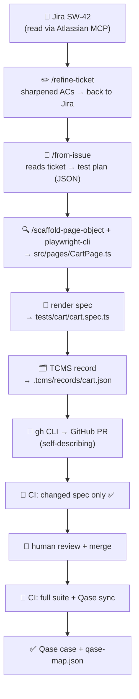

# From ticket to merged test — a worked walkthrough

> A short, follow-along example of how **one Jira ticket becomes a reviewed, TCMS-mirrored Playwright test**. The point to remember: **each step's output is the next step's input.** If you only take away one thing, take the [artifact chain](#the-artifact-chain) at the bottom.

For the deep reference on any step, see [`from-issue.md`](from-issue.md); this page is the friendly overview.

---

## The mental model

A ticket flows through a chain of Claude Code skills. Nothing is magic at runtime — the tests are plain Playwright. The "AI" is the **authoring** layer that turns a ticket into those tests, one hand-off at a time.



---

## The example ticket (the input)

**`SW-42` — "Remove a product from the cart"** _(in Jira, project SW)_

```
As a shopper, I want to remove an item from the cart so I can change my order.

AC1: From the cart page, clicking Remove on a product removes it from the cart.
AC2: Removing the last item hides the cart badge.
```

---

## Step by step — what each step creates

### ① `/refine-ticket` — _(optional, runs first)_

Reads the ticket via the **Atlassian MCP**, hardens the ACs against a "bulletproof" rubric, and — on your approval — **writes the sharpened ACs back to Jira**.

> **Produces:** a crisp ticket in Jira, so the next step has nothing to guess. _(This is the only skill that writes to Jira.)_

### ② `/from-issue SW-42` — reads + plans

Reads the refined ticket (Atlassian MCP again), then applies senior-QA judgment to turn the ACs into a **test plan**.

> **Produces — the "semantic model" (an in-memory JSON plan):**

```json
[
  {
    "title": "removing a product drops it from the cart",
    "covers": [1],
    "user": "standard_user",
    "tags": ["@standard"],
    "bucket": "Positive",
    "smoke": true
  },
  {
    "title": "removing the last item hides the cart badge",
    "covers": [2],
    "user": "standard_user",
    "tags": ["@standard"],
    "bucket": "Edge",
    "smoke": false
  }
]
```

This plan is the spine everything downstream is built from.

### ③ Resolve the Page Object → maybe `/scaffold-page-object`

_"Does `CartPage` exist?"_

- **Exists** → reuse it, appending a `removeProduct()` method if it's missing.
- **Missing** → call **`/scaffold-page-object`**, which uses **`playwright-cli`** to snapshot the live cart page (logged in as `standard_user` — the default inspection session) and drafts the class.

> **Produces — `src/pages/CartPage.ts`:**

```ts
async removeProduct(name: string): Promise<void> {
  await test.step(`Remove ${name} from cart`, async () => {
    await this.cartItem(name).getByRole('button', { name: /^Remove$/i }).click();
  });
}
```

> ℹ️ The snapshot login is throwaway — it only gets past the login screen so the tool can read the page's DOM. Which user each _test_ runs as is decided separately (next step).

### ④ Grow the harness — _(only if needed)_

Computes the **required user set** from the plan. Here every test is `@standard` → `standard_user` is already wired → **nothing to do**.

> _If a ticket needed, say, `problem_user`, this step would autonomously add it to `tests/users.ts` `AUTH_USERS` and the data-driven config would derive its project + auth setup._

### ⑤ Render the spec

Turns each plan entry into a real spec that calls the Page Object.

> **Produces — `tests/cart/cart.spec.ts`:**

```ts
test.describe('cart — standard_user', { tag: '@standard' }, () => {
  test('removing a product drops it from the cart', async ({ cartPage }) => {
    await cartPage.goto();
    await cartPage.removeProduct('Sauce Labs Backpack');
    expect(await cartPage.getProductNames()).not.toContain('Sauce Labs Backpack');
  });
});
```

### ⑥ Run the tests + write the TCMS record

Runs `npx playwright test` on the new specs to prove they're green, then writes a provenance record (the seed for the later Qase case).

> **Produces — `.tcms/records/cart.json`:**

```json
{
  "title": "removing a product drops it from the cart",
  "acText": "Clicking Remove removes the product from the cart",
  "user": "standard_user",
  "feature": "cart",
  "jira": [{ "key": "SW-42", "url": "https://…/browse/SW-42" }]
}
```

### ⑦ Commit + open the PR — _(via the `gh` CLI)_

Branches `SW-42-cart`, commits the spec + Page Object + record, and opens a GitHub PR.

> **Produces — a self-describing PR** whose body carries:
>
> - **"What I understood"** summary
> - **AC-coverage table** — AC1 → test ✅, AC2 → test ✅
> - **⚠️ Assumptions** the agent made — e.g. _"user unspecified → defaulted to `standard_user`"_
> - **Verification** — `2 passed`

### ⑧ CI on the PR

Typecheck + strict lint (`--max-warnings 0`) + **only the changed spec** → fast, focused green check. The GitHub-for-Jira app auto-links the PR onto ticket SW-42.

### ⑨ Human reviews & merges

You read the self-explaining PR and merge. **This is the gate — a person always approves.**

### ⑩ CI on merge

Runs the **full suite**, **syncs the catalog to Qase** (turning `.tcms/records/cart.json` into a human-readable Qase case), and commits the refreshed `qase-map.json`.

> **Resolution:** SW-42 is now a reviewed, merged, TCMS-mirrored test. ✅

---

## The artifact chain

The single table to explain the whole thing to someone:

| Step        | Tool                                       | Produces → handed to            |
| ----------- | ------------------------------------------ | ------------------------------- |
| Refine      | `/refine-ticket` + Atlassian MCP           | sharpened ACs _(in Jira)_       |
| Read + plan | `/from-issue` + Atlassian MCP              | **test records** (JSON plan)    |
| Page Object | `/scaffold-page-object` + `playwright-cli` | `src/pages/CartPage.ts`         |
| Render      | `/from-issue`                              | `tests/cart/cart.spec.ts`       |
| Record      | `/from-issue`                              | `.tcms/records/cart.json`       |
| Ship        | `gh` CLI                                   | **GitHub PR**                   |
| Merge       | 👤 human                                   | `main`                          |
| Mirror      | CI                                         | **Qase case** + `qase-map.json` |

---

## Explain it in one sentence

> _"A ticket goes in; an AI chain writes the page object + test + a traceability record, runs them, and opens a pull request that explains itself — a human reviews and merges, and CI mirrors it into a test-case tool. Every step's output feeds the next, and a person is always the final gate."_

---

## See a real one

[**PR #25 — _automate SW-11 burger menu scenarios_**](https://github.com/Diegocortes15/playwright-ia-automation-framework-saucedemo/pull/25) is an actual `/from-issue` pull request from this repo — the same flow above, on a real ticket.
