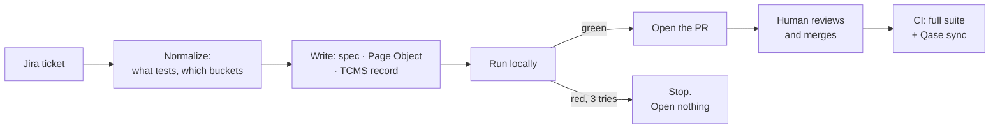

# From a ticket to a merged test — a walkthrough

Follow two real tickets through the whole pipeline. Every artifact below is in this repository; nothing here is invented for the example.

- **[SW-15](https://github.com/Diegocortes15/playwright-ia-automation-framework-saucedemo/pull/53)** — the ordinary path: a ticket becomes two tests and a merged PR.
- **[SW-13](https://github.com/Diegocortes15/playwright-ia-automation-framework-saucedemo/pull/49)** — the interesting path: the application contradicted the ticket, so no PR was opened at all.

---

## The one idea worth having first

**The AI writes once. Every run after that is plain Playwright.**

This is the thing that makes the rest make sense. When `/from-issue` finishes, it has written ordinary files into the repository — a spec, maybe a Page Object, and a record in `.tcms/records/<feature>.json`. All of them are committed. From then on:

|                                                         | Who does it                                         | Needs Claude Code? |
| ------------------------------------------------------- | --------------------------------------------------- | ------------------ |
| Read the ticket, decide the tests, write them           | The agent, **once**                                 | Yes                |
| Run the tests                                           | Playwright                                          | No                 |
| Show which acceptance criterion a test covers           | A Playwright fixture reading the committed record   | No                 |
| Explain in plain English why a test is expected to fail | The same fixture, reading text the agent wrote once | No                 |
| Record what the app did that no test asserted on        | A Playwright fixture                                | No                 |

So a teammate who clones this repo, has never installed Claude Code, and runs `npm test` still gets the Jira links, the acceptance criteria, and the human-readable explanations. They are **artifacts in git**, not something generated live.

What that teammate does _not_ get is a **new** explanation for a **new** defect — for that, someone has to author it. The agent's job is writing the explanation once; the framework's job is never losing it.

---

## The pipeline


```mermaid
flowchart LR
    T["Jira ticket"] --> N["Normalize:<br/>what tests, which buckets"]
    N --> W["Write: spec · Page Object<br/>· TCMS record"]
    W --> R["Run locally"]
    R -->|green| PR["Open the PR"]
    R -->|"red, 3 tries"| B["Stop.<br/>Open nothing"]
    PR --> H["Human reviews<br/>and merges"]
    H --> CI["CI: full suite<br/>+ Qase sync"]
```

---

## The ordinary path — SW-15

> _"[SW][QA][Login] locked_out_user cannot sign in"_

### 1. Read the ticket

`/from-issue SW-15` reads it through the Atlassian MCP — never `gh issue`. Nothing is transcribed by hand.

### 2. Decide what tests to write

Two acceptance criteria became two tests, each labelled with a **bucket**:

| Bucket       | Test                                                                                      |
| ------------ | ----------------------------------------------------------------------------------------- |
| **Negative** | `locked_out_user is rejected with the lockout error`                                      |
| **Edge**     | `locked_out_user with a wrong password sees the credentials error, not the lockout error` |

The Edge one is the more interesting call: the same locked-out user, but the _wrong_ password, must produce the **credentials** error rather than the lockout one. Two different messages, one easy bug.

### 3. Check what already exists

Nothing new was needed here, and that is the common case:

- `LoginPage` already existed → no `/scaffold-page-object` call.
- Both tests are `@no-auth` (they run against the login form itself), so **no new authenticated project** was needed. `AUTH_USERS` was untouched.

Had either been missing, the run would have scaffolded the Page Object, or appended one user to `tests/users.ts` — which is the only file that decides the project matrix.

### 4. Write into the file that already exists

`tests/login/login.spec.ts` was already there, created by SW-1 back in May. The run **added to it** rather than creating `login-2.spec.ts`, and stamped the header:

```ts
// Generated by /from-issue on 2026-05-25 from Jira SW-1.
// Augmented by: SW-15 (2026-09-07)
// Manual edits are welcome — this file is not regenerated automatically.
```

That header is how the next run knows this ticket already contributed, and refuses to write it twice.

### 5. Write the record that makes the report readable

Alongside the spec, one entry per test in `.tcms/records/login.json`:

```json
{
  "title": "locked_out_user is rejected with the lockout error",
  "acText": "locked_out_user submitting the correct password … is not authenticated …",
  "bucket": "Negative",
  "tags": ["@no-auth"],
  "feature": "login",
  "jira": [{ "key": "SW-15", "url": "https://…/browse/SW-15" }]
}
```

This is the file the runtime reads forever after. It is why the HTML report can tell you _which criterion_ a test covers, with no AI in the loop.

### 6. Run them, then open the PR

The tests ran locally and passed, so [**PR #53**](https://github.com/Diegocortes15/playwright-ia-automation-framework-saucedemo/pull/53) opened with exactly three files changed:

```
tests/login/login.spec.ts         +45 / -1     the tests
.tcms/records/login.json          +84 / -9     what makes the report readable
.observations/observations.json   +22 / -4     what the app did while they ran
```

The PR body carries what the agent understood, an AC-coverage table, and any assumptions it made — so a reviewer reads the reasoning, not just the diff.

### 7. Merge

CI on the PR ran only the specs that PR touched. On merge it ran the full suite and synced the Qase catalog. Nobody typed a test case anywhere.

---

## The interesting path — SW-13

Same pipeline, different ending: **the application disagreed with the ticket.**

SW-13 asked that `problem_user` be able to sort products by name and price. The generated tests were correct. The app was not — the sort dropdown discards the selection and silently reverts.

**So the run opened nothing.** A run never opens a red pull request: it diagnoses, retries up to three times, and if the failure means the _app_ contradicts the criterion rather than the generated code being wrong, it stops and reports.

What happened next needed a person. A human confirmed the app was wrong, filed **SW-14** as the defect, and only then did [**PR #49**](https://github.com/Diegocortes15/playwright-ia-automation-framework-saucedemo/pull/49) land the tests — marked `test.fail()`, locked to that defect. Its own description opens:

> This PR exists **because** a `/from-issue` run was blocked, not despite it.

Now run them:

```bash
npx playwright test --project=chromium-problem
```

```
✘ problem_user sorts products by name descending
✘ problem_user sorts products by price ascending
✓ problem_user sees one identical broken image for every product

4 passed (3.7s)
```

**Two tests failed and the suite is green.** They assert the _correct_ behaviour, so they must fail while the bug is open. Open the report and each one explains itself:

> **known defect** · SW-14 — the inventory sort dropdown discards the selection for problem_user: the `<select>`'s own value reverts to `az`, so neither the active label nor the product order ever changes. This test asserts the correct behaviour and is expected to fail while the defect is open, so the suite stays green. The day it is fixed the run reports "Expected to fail, but passed." — remove the `test.fail()` marker in that same pull request.

That last sentence is the point. **The suite notifies you when the bug is fixed.** Nobody has to remember.

And that whole paragraph is text an agent wrote once into `.tcms/records/inventory.json`. Reading it back takes no AI at all.

---

## The artifact chain

| Step                                | Produces                         | Committed? | Read later by                         |
| ----------------------------------- | -------------------------------- | ---------- | ------------------------------------- |
| Read the ticket                     | The requirement, normalized      | no         | the next step                         |
| Decide the tests                    | Bucket + tags per test           | no         | the renderer                          |
| Scaffold _(only if missing)_        | `src/pages/<Name>.ts`            | yes        | every test that uses it               |
| Grow the harness _(only if needed)_ | one line in `tests/users.ts`     | yes        | `playwright.config.ts`                |
| Render                              | `tests/<feature>/*.spec.ts`      | yes        | Playwright                            |
| Record                              | `.tcms/records/<feature>.json`   | yes        | the report fixture, and Qase at merge |
| Run                                 | report · traces · observations   | index yes  | you, and `/report-bug`                |
| Open the PR                         | reasoning, AC table, assumptions | —          | the reviewer                          |
| Merge                               | Qase cases + refreshed id map    | yes        | non-technical reviewers               |

The **committed** column is the one to read twice. Everything that has to survive is a file in git.

---

## In one sentence

A Jira ticket goes in; a reviewed pull request comes out carrying the tests, the criterion each one covers, and a plain-English note for anything that cannot pass yet — and every run after that replays all of it with no AI involved.

---

## See it yourself

The README's [five-minute demo](../README.md#see-it-work--a-five-minute-demo) runs the SW-13 branch above end to end. For the reasoning behind each rule, start at [`docs/adr/README.md`](adr/README.md).
